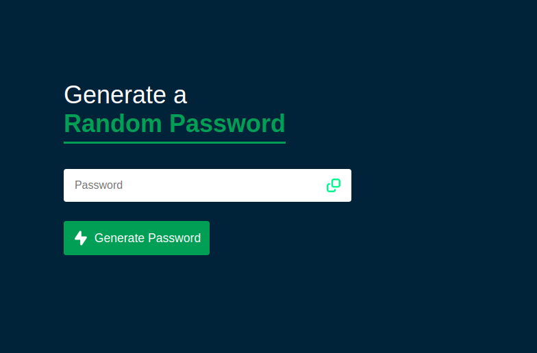

# 🔐 Password Generator

    

## Sobre este Projeto

Este projeto consiste em um Gerador de Senhas Aleatórias, uma página HTML simples que gera senhas fortes e aleatórias. Ele foi desenvolvido com o objetivo de fornecer uma ferramenta útil para garantir a segurança das suas informações pessoais e de suas contas online.

## Por que ❓

A segurança das senhas é de extrema importância para proteger informações pessoais e evitar acesso não autorizado a contas online. O Gerador de Senhas Aleatórias foi criado para facilitar a geração de senhas fortes e complexas, com caracteres variados, e incentivar as boas práticas de segurança.

## Descrição

O Gerador de Senhas Aleatórias é uma página HTML simples que gera senhas fortes e aleatórias. Com apenas um clique, você pode criar uma senha segura com letras maiúsculas, letras minúsculas, números e símbolos. É uma ferramenta útil para garantir a segurança das suas informações pessoais e de suas contas online.

## Como Usar 📋

1. Abra o arquivo `index.html` em seu navegador preferido.
2. Clique no botão "Gerar Senha" para obter uma senha aleatória.
3. A senha gerada será exibida na caixa de texto abaixo do botão.
4. Se desejar copiar a senha para a área de transferência, clique no ícone de "clonar" ao lado da caixa de texto.

## Pré-requisitos 📦

Nenhum pré-requisito é necessário para utilizar o Gerador de Senhas Aleatórias. Basta ter um navegador web atualizado.

## Personalização 🎨

Você pode personalizar o gerador de senhas para atender às suas necessidades. Algumas sugestões de personalização incluem:

- Alterar o comprimento padrão da senha.
- Adicionar mais símbolos ou remover alguns dos existentes.
- Estilizar a página HTML com seu próprio CSS.

## Tecnologias Utilizadas 🛠️ 

    * HTML
    * CSS
    * JavaScript

## Ferramentas de Suporte 🔧 

Durante o desenvolvimento deste projeto, foram utilizadas as seguintes ferramentas:

    Visual Studio Code: editor de código-fonte.
    Git: sistema de controle de versão.
    GitHub: plataforma de hospedagem de código-fonte e colaboração.
    Navegadores Web: utilizados para testar e visualizar o Gerador de Senhas Aleatórias em diferentes ambientes.

## Contribuição 🤝

Contribuições são bem-vindas! Se você quiser melhorar o Gerador de Senhas Aleatórias, siga as etapas abaixo:

1. Faça um fork deste repositório.
2. Crie uma nova branch com suas alterações: `git checkout -b minha-branch`
3. Commit suas alterações: `git commit -am 'Adicionar recurso incrível'`
4. Push para o branch: `git push origin minha-branch`
5. Abra um pull request no GitHub.

## Licença 📄

Este projeto está licenciado sob a [MIT License](LICENSE).
